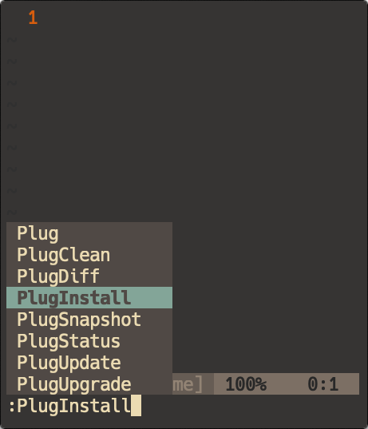

# osgiliath
Dotfiles - The Citadel of Stars

------------------------


------------------------

### Installation
GNU `stow` is uses symlinks to place these dotfiles in the appropriate directories

First install `stow`

```
brew install stow
```

Next clone this repository into your `$HOME`

```
mkdir ~/.osgiliath
cd ~/.osgiliath
https://github.com/amanchokshi/osgiliath.git .
```

Install the dotfiles with

```
source install.sh
```
Ignore any errors in this script, they result from a bug in `stow v2.3.1`

Install `neovim` plugings by opening nvim and running the command `:PlugInstall`

```
nvim
:PlugInstall
```



### Notes

Virtual environments can be tough on python plugins. I create a `pyenv` virtualenv called `tools` where I install

```
pip install pynvim
pip install black
pip install flake8
pip install isort
pip install shellcheck
```


In my `init.vim` I tell `nvim` to uses the `tools` virtualenv as its python version

```
let g:python3_host_prog = expand("~/.pyenv/versions/tools/bin/python")
```

This works in ensuring that `nvim` can always find `pynvim` even in a virtualenv. Doing the same for other python
is more complex.

First, I create a directory `~/.nvim/bin` and add it to my path

```
export PATH="$HOME/.nvim/bin:$PATH"
```

Then, I link each python package in `tools` to `~/.nvim/bin` using symlinks

```
ln -s `pyenv which flake8` ~/.nvim/bin/flake8
ln -s `pyenv which black` ~/.nvim/bin/black
ln -s `pyenv which isort` ~/.nvim/bin/isort
ln -s `which shellcheck` ~/.nvim/bin/shellcheck
ln -s `pyenv which instantrst` ~/.nvim/bin/instantrst
```

This adds the packages to my `PATH`, and somehow makes linting work in all virtualenvs

#### SSHFS for MacOS

It is incredibly useful to be able to browse remote files in the finder. This can be done using the `SSHFS` program.

```
brew cask install osxfuse
brew install sshfs
```

Check out this [article](https://medium.com/@tzhenghao/writing-remote-code-on-a-mac-with-sshfs-c62d64bf9ef9) for 
more details on setting up `SSHFS` on MacOS.

To mount `Ucalegon` & `Ozstar` make the following directories and then use the `aliases` provided in my `.zshrc`

```
mkdir ~/Ucalegon
mkdir ~/Ozstar

# To mount the remote directories
ucalegon_sshfs
ozstar_sshfs
```
